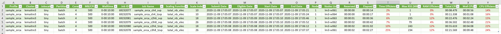

*****************
Benchmarking tool
*****************

Why is it useful?
=================

As mentioned in the :doc:`abin_launcher.job_scale` section, one of the key parts of the scaling process is the definition of your job scales. A good amount of finely tuned job scales will allow you to avoid wasting resources, thus diminishing your fairshare usage of the cluster, making your jobs spend less time waiting in the queue. Since this is highly dependent on the program you want to run and the cluster on which it will be running, you will need to do extensive testing on your part. 

With that said, if your cluster uses SLURM as a job scheduler, we might be able to offer some help in that regard through a benchmarking tool. This tool allows you to see the efficiency of your resources requirements, by calculating how much of the allocated resources were actually used by the job.

Important SLURM commands
========================

The ``sacct`` and ``squeue`` commands
-------------------------------------

The two key SLURM commands we use here are ``sacct`` and ``squeue``. The ``sacct`` command can directly fetch job accounting data from the SLURM database. Depending on your cluster configuration however, reaching the SLURM database can necessitate an Internet access, which the computing nodes might not have. This command will then only be used from the login nodes, when the job has finished. On the other hand, the ``squeue`` command gets its information locally, which means we can use it for the information that will be obtained through the job instructions file, while the job is still running.

Every data about our jobs will be obtained through those two commands. If you want to customize the benchmarking procedure, you should familiarize yourself with them on SLURM's official documentation (`sacct docs <https://slurm.schedmd.com/sacct.html>`_ and `squeue docs <https://slurm.schedmd.com/squeue.html>`_). 

The ``seff`` command: a possible alternative
--------------------------------------------

An alternative option is the ``seff`` command (see `source code <https://github.com/SchedMD/slurm/blob/master/contribs/seff/seff>`_ and `example <https://sites.google.com/a/case.edu/hpcc/jobs/slurm-command-overview/seff>`_). While it pretty much does exactly what we want, there are however some problems with it:

- It requires SLURM 15.08 or a more recent version, which might cause problems with some older machines.
- It does not give reliable statistics when the job is running, so a :ref:`cron task <cron_tuto>` or similar* will be needed in order to automatically check the resources usage after the job has ended.
- It computes the CPU and memory efficiencies, but nothing is done about the time efficiency.

Other than that, it still is a good option so feel free to use it if it satisfies your needs!

\* If your cluster administrator allows it, you can also use the ``strigger`` command to trigger a script executing the ``seff`` command at the end of the job, consult the `documentation <https://slurm.schedmd.com/strigger.html>`_ for details.

How does it work?
=================

Required files
--------------

This process requires three files:

- A Jinja template, named ``benchmark.jinja``, placed in the ``templates`` directory of ``ABIN LAUNCHER``. It is an extension of the job instructions template.
- A Python script, named ``benchmark.py``, which must be placed in ``ABIN LAUNCHER``'s directory.
- A Shell script, named ``cron_benchmark.sh``, which must also be placed in ``ABIN LAUNCHER``'s directory. It will be executed through a :ref:`cron task <cron_tuto>` and make the link between the first two files.

The role of the Jinja template
------------------------------

At the end of the job instructions, some additional commands, provided by the ``benchmark.jinja`` template, will fetch the following information:

- The name of the program and the name of the cluster
- The chosen job scale and its associated resources requirements
- The job ID and name
- The scaling function and the computed scale index
- The number of nodes and the nodes list
- Four dates: the submit date, the eligible date, the start date and the end date (which is the current date at which the job ends since those instructions are executed at the end of the job script)

Some of that information is provided directly by ``ABIN LAUNCHER`` while the others are obtained through the ``squeue`` command. The Jinja template will then store that information by either creating or updating a **temporary CSV file**.

.. warning::

   The job ID and name are the crucial parts of this file. No matter how you want to customize it, you *must* keep that information in the temporary CSV file. Otherwise, the Python script won't be able to fetch its data.

The role of the crontab script
------------------------------

Meanwhile, on the cluster, the ``cron_benchmark.sh`` Shell script will be periodically executed through a cron task to check the existence of that temporary CSV file. If the file exists, the script will archive it then execute the ``benchmark.py`` Python script to scan and process its content.

The role of the Python script
-----------------------------

The ``benchmark.py`` Python script will read the content of the temporary CSV file, then fetch the following data using the ``sacct`` command: 

- The "reserved", or queued, time (time between the submit date and the eligible date)
- The elapsed time (duration of the job)
- The **time efficiency** (percentage of used time vs required time)
- The maximum used memory (in MB)
- The **memory efficiency** (percentage of used memory vs required memory)
- The total time used by all of the CPUs
- The "wall CPU", which is the total amount of time CPUs could have used (derived from the duration of the job and the number of CPUs)
- The **CPU efficiency** (percentage of total time used by the CPUs vs "wall CPU")

Then the script will store that information by either creating or updating a **final CSV file**. That file is a repeat of what was already present in the temporary file, enriched by the new data provided by the ``sacct`` command.

The only thing left to do is then to make a copy of that final CSV file on your local computer and open it in your favorite spreadsheet! (like Microsoft Excel)

Usage and configuration
=======================

Before starting to edit the files, you need to decide two important values:

- ``benchmark_path``, which is the location of your benchmark directory, i.e the directory where all the output files of this benchmarking tool will be stored.
- ``prefix``, which is the prefix that will be common to all the files created by this tool.

Prepare the Jinja template
--------------------------

First of all, make sure the ``benchmark.jinja`` template is present in the ``templates`` directory of ``ABIN LAUNCHER``. Then add the following line at the end of your job instructions template (which should be in the same directory):

.. code-block:: jinja

   

Since that template requires some specific variables, add the following code to your :ref:`rendering function <rendering_fct>` *after* having defined your ``render_vars`` dictionary for your job instructions file, but *before* calling the ``jinja_render`` function for that file:

.. code-block:: python

   render_vars.update({
      "benchmark_path" : <value>,
      "prefix": <value>,
      "prog" : job_specs['prog'],
      "cluster_name" : job_specs['cluster_name'],
      "jobscale_label" : job_specs['scale_label'],
      "job_walltime" : job_specs['walltime'],
      "job_mem_per_cpu" : job_specs['mem_per_cpu'], # in MB
      "scaling_function" : job_specs['scaling_fct'],
      "scale_index" : job_specs['scale_index']
   })

where ``benchmark_path`` is the path towards your benchmark directory and ``prefix`` the desired prefix for your benchmarking output files.

Now, at the end of your job, a new temporary CSV file will be created in your benchmark directory, named ``<prefix>_tmp.csv``. If the file already exists, a new line will simply be added to it.

Configure the cron task
-----------------------

Use the ``crontab -e`` command in your terminal to edit your cron tasks and add the following line:

.. code-block::

   */15 * * * * bash -l -c "/path/to/cron_benchmark.sh <prefix> <benchmark_path>" >> benchmark_path/<prefix>_crontab.log 2>&1

where

- ``*/15 * * * *`` defines the frequency of execution of this command (at every 15th minutes). Feel free to adjust this value.
- ``/path/to/cron_benchmark.sh`` is the path towards the crontab script.
- ``<prefix>_crontab.log`` is a log file that will contain the output of the execution of this crontab script. This is just a suggested name, feel free to change it however you like.

Don't forget to also make the ``cron_benchmark.sh`` script executable (``chmod u+x``) !

When executed, the ``cron_benchmark.sh`` script will look if there is a file named ``<prefix>_tmp.csv`` (the temporary CSV file) in your benchmark directory. If there is, the script will archive it into an ``archive`` subdirectory and rename it with the current date. It will then execute ``benchmark.py`` on that file.

.. Tip::

   If it is not loaded by default in your user profile configuration, remember to load your Python distribution so that the crontab script can execute ``benchmark.py``. This can for example be done by adding instructions at the beginning of the crontab script, or by executing the loading command in the cron task, right before executing the crontab script.

The Python script
-----------------

.. argparse::
   :module: benchmark
   :func: parser
   :prog: benchmark.py
   :nodescription:

How to use it?
~~~~~~~~~~~~~~

You don't need to edit the Python script, it will be automatically executed by the crontab script with the following arguments:

- ``<benchmark_path>/<prefix>_tmp.csv`` for the :guilabel:`-t, \\--tmp` argument
- ``<benchmark_path>/<prefix>_final.csv`` for the :guilabel:`-f, \\--final` argument
- ``<benchmark_path>/<prefix>_prob.csv`` for the :guilabel:`-p, \\--prob` argument

This will either create or update the final csv file, named ``<prefix>_final.csv`` and placed inside the benchmark directory. The log file of this Python execution, named ``<prefix>_<current_date>.log``, can be found inside a ``bench_logs`` subdirectory created by the crontab script. 

How to deal with problematic lines?
~~~~~~~~~~~~~~~~~~~~~~~~~~~~~~~~~~~

If some lines of the temporary CSV files were to cause any kind of problem, they will be stored inside a **problematic CSV file**, named ``<prefix>_prob.csv`` and placed inside the benchmark directory. After having consulted the log file and diagnosed the problem, you might then wish to rerun the Python script on this file. In this case, you can just either:

- manually execute ``benchmark.py`` using the path towards the problematic CSV file for the :guilabel:`-t, \\--tmp` argument (and something else for the :guilabel:`-p, \\--prob` one)
- rename ``<prefix>_prob.csv`` into ``<prefix>_tmp.csv``\*, then manually execute ``cron_benchmark.sh`` (with ``<prefix>`` as a command line argument).

\* Be careful to not erase a *real* temporary CSV file by doing so.

Dealing with multiple programs or clusters
------------------------------------------

Unfortunately, this tool works with one program and one cluster at a time. If you have multiple programs you want to run with ``ABIN LAUNCHER``, or multiple clusters, you will have to configure the benchmarking tool for each of the program-cluster combination.

This implies that you need to:

- Add the include line to all job instructions file templates.
- Add the Jinja variables definition (``render_vars.update``) to all the rendering functions.
- Add the cron task command to the crontab of every cluster 

Multiple programs can share the same crontab task if you don't mind their lines being in the same CSV file.

Sample run
==========

Let's end this section with a sample run of the benchmarking tool. We will use our example from the :doc:`previous section <abin_launcher.example>`, with the three molecules (or geometry files) and the two configuration files. 

.. Tip::

   Every file presented in this subsection can be downloaded `here <https://github.com/niacobel/CHAINS/tree/master/docs/source/benchmark_sample_files>`_.

Preparation
-----------

Our ``benchmark_path`` will be ``/home/users/n/i/niacobel/abin_docs_sample/benchmark`` and our prefix will be ``sample_orca``.

This is our starting directory structure:

.. code-block::

   abin_docs_sample/
      └── abin_launcher/ 
            ├── benchmark.py
            ├── cron_benchmark.sh
            ├── abin_launcher.py
            ├── geom_scan.py
            ├── scaling_fcts.py
            ├── renderer.py
            ├── abin_errors.py
            ├── clusters.yml
            ├── mendeleev.yml
            └── templates/
                  ├── benchmark.jinja
                  ├── sample_orca.inp.jinja
                  └── sample_orca_job.sh.jinja
      └── molecules/ 
            ├── ch4.xyz
            ├── c2h6.xyz
            └── c3h8.xyz
      └── configs/ 
            ├── svp.yml
            └── tzvp.yml
      └── orca_jobs/ 
            └── currently empty

Note that our benchmark directory does not exist yet, but this is not necessary since the instructions contained in the Jinja template can create it if needed.

The Jinja template
~~~~~~~~~~~~~~~~~~

At the end of ``sample_orca_job.sh.jinja``, we add the following line:

.. code-block:: jinja

   

and in the ``orca_render`` function of ``renderer.py``, we add

.. code-block:: python

   render_vars.update({
      "benchmark_path" : "/home/users/n/i/niacobel/abin_docs_sample/benchmark",
      "prefix": "sample_orca",
      "prog" : job_specs['prog'],
      "cluster_name" : job_specs['cluster_name'],
      "jobscale_label" : job_specs['scale_label'],
      "job_walltime" : job_specs['walltime'],
      "job_mem_per_cpu" : job_specs['mem_per_cpu'], # in MB
      "scaling_function" : job_specs['scaling_fct'],
      "scale_index" : job_specs['scale_index']
   })

.. container:: toggle

   .. container:: header

      If you are not sure of where exactly you need to add this portion of code, you can click on the arrow below to see the complete source code of ``renderer.py``.

   .. literalinclude:: benchmark_sample_files/renderer.py
      :caption: renderer.py
      :emphasize-lines: 126-138

|

The cron task and the crontab script
~~~~~~~~~~~~~~~~~~~~~~~~~~~~~~~~~~~~

Now we execute the ``crontab -e`` command in our terminal to edit our cron tasks and add the following line:

.. code-block::

   */15 * * * * bash -l -c "/home/users/n/i/niacobel/abin_docs_sample/abin_launcher/cron_benchmark.sh sample_orca /home/users/n/i/niacobel/abin_docs_sample/benchmark" >> /home/users/n/i/niacobel/abin_docs_sample/benchmark/sample_orca_crontab.log 2>&1

Finally, we edit the beginning of our ``cron_benchmark.sh`` file to load our Python distribution:

.. literalinclude:: benchmark_sample_files/cron_benchmark.sh
   :caption: cron_benchmark.sh, lines 7-15
   :lines: 7-15

and we make sure it is executable by entering the following command in our terminal:

.. code-block:: console

   $ chmod u+x /home/users/n/i/niacobel/abin_docs_sample/abin_launcher/cron_benchmark.sh

Now our benchmarking tool is ready to run!

Execution
---------

We just run ``ABIN LAUNCHER`` as normal, by executing the main script (from ``abin_docs_sample``):

.. code-block:: console

   $ python abin_launcher/abin_launcher.py -m molecules/ -cf configs/ -p orca -o orca_jobs/ -cl lemaitre3

We obtain the same results than before, with the six launched jobs. 

As soon as each job finishes, the temporary CSV file will either be created or updated with a new line. After the six jobs have finished, this is what the raw file looks like:

.. literalinclude:: benchmark_sample_files/sample_orca_tmp.csv
   :caption: sample_orca_tmp.csv

and in a more human-readable fashion:

.. csv-table::
   :file: benchmark_sample_files/sample_orca_tmp.csv
   :delim: ;
   :name: sample_orca_tmp.csv

As you can see, a different line has been written for each of our jobs, containing the different data that have been collected so far.

After at most 15 minutes, the crontab task executes the crontab script, which archives the temporary CSV file and then runs the Python script on that file to either create or update the final CSV file. The directory structure now looks like:

.. code-block::

   abin_docs_sample/
      └── abin_launcher/ 
            └── no changes
      └── benchmark/
            ├── sample_orca_crontab.log
            ├── sample_orca_final.csv
            └── archive/
                  └── sample_orca_tmp_20201109_171504.csv
            └── bench_logs/
                  └── sample_orca_20201109_171504.log
      └── molecules/
            └── launched/
      └── configs/ 
            └── launched/
      └── orca_jobs/ 
            └── ch4_svp/
            └── ch4_tzvp/
            └── c2h6_svp/
            └── c2h6_tzvp/
            └── c3h8_svp/
            └── c3h8_tzvp/

where our final CSV file, ``sample_orca_final.csv``, contains:

.. csv-table::
   :file: benchmark_sample_files/sample_orca_final.csv
   :delim: ;
   :name: sample_orca_final.csv

Once loaded into Microsoft Excel, we can then get a nice view of every important data about our jobs:

    
    Excel view of the final CSV file ``sample_orca_final.csv`` (click to zoom in)
    
Here we can see that our job scale definition does not look that good with all those low efficiency percentages. However, those were really small jobs made purely for illustration purposes and they do not have to be taken too seriously. For real, bigger jobs though, you should aim for higher efficiencies.

.. note::

   The temporary CSV file has been archived into the ``archive`` directory, as ``sample_orca_tmp_20201109_171504.csv``. This copy is kept purely as backup for the data. Once you've make sure those jobs have been correctly benchmarked, you can remove the copy.

Content of the log files
------------------------

As you can see in the directory structure above, the benchmarking tool creates two log files:

- The log file from the crontab script, which contains a line for each time a temporary CSV file has been processed. At this point, its content is simply:

   .. literalinclude:: benchmark_sample_files/sample_orca_crontab.log
      :language: text
      :caption: sample_orca_crontab.log

- 
   .. container:: toggle

      .. container:: header

         The log file from the Python script, ``sample_orca_20201109_171504.log``, placed inside the ``bench_logs`` directory. Click on the arrow below to see its content.

      .. literalinclude:: benchmark_sample_files/sample_orca_20201109_171504.log
         :language: text
         :caption: sample_orca_20201109_171504.log

