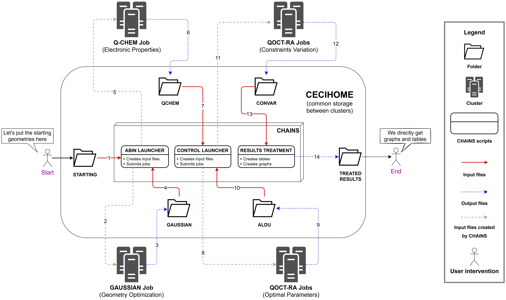

****************
CHAINS' Workflow
****************

    ..

|

.. centered:: 
   *Global overview of CHAINS' workflow (click to zoom in)*

Characterization Phase (Steps 1-3 and 5-6)
==========================================

*This phase is covered by the first main script of CHAINS, named* ``ABIN LAUNCHER``. *Consult its* :doc:`specific documentation <abin_launcher.overview>` *for details*.

``ABIN LAUNCHER`` starts by scanning the molecule structure file (the geometry file) and uses it to build the input files associated with the ab initio program we want to run. Once those files have been prepared, the corresponding job will be launched. Note that the characterization phase is split into two jobs and that ``ABIN LAUNCHER`` is executed twice. The first time, it is used to assist the geometry optimization of the molecule through the Gaussian_ program. The second time, it is used to assist the calculation of different properties of our molecule through the Q-CHEM_ program.

.. Important::
   ``ABIN LAUNCHER`` **is completely autonomous.** It does not need any files outside the ones present in its own directory. It can be extracted and used to launch independent calculations, and can be very easily adapted to deal with other ab initio programs.

.. note:: 
   The reason this characterization phase is split in two jobs is because the Q-CHEM_ program is locked by license on a single cluster, and we want to make the most use out of this cluster. Since the geometry optimization can be handled by another program, we have separated it from the rest in order to free some resources and gain some time.

Control Phase (Steps 8-9 and 11-12)
==================================

*This phase is covered by the second main script of CHAINS, named* ``CONTROL LAUNCHER``. *Consult its* :doc:`specific documentation <control_launcher.overview>` *for details*.

``CONTROL LAUNCHER`` starts by scanning the Q-CHEM output file and uses it to build an effective Hamiltonian for our molecule (we call that the modelling process). Once in possession of this effective Hamiltonian, multiple jobs will be launched in order to perform a quantum control procedure through QOCT-GRAD_. The first wave of jobs (steps 8-9) is used to determinate the optimal control parameters (the penalty factor and the duration of the pulse). Once it is done, a second wave of jobs (steps 11-12) is launched in order to study the impact of additionnal constraints on the control procedure.

Results Phase (Step 14)
=======================

*This phase is covered by the third main script of CHAINS, named* ``RESULTS TREATMENT``. *Consult its* :doc:`specific documentation <chains.results_treatment>` *for details*.

There is no calculation involved in this phase. As its name implies, ``RESULTS TREATMENT`` is designed to treat the results from the previous steps and compile them into graphs and tables, for ease of interpretation and comparison.

Link between scripts (Steps 4, 7, 10 and 13)
============================================

In order to link all those scripts together and allow communication between clusters, CHAINS makes use of the common CECI storage, known as ``CECIHOME``. Every important file is copied and stored into the ``CECIHOME``, then different Bash scripts on different clusters are periodically executed through cron_ tasks to scan the ``CECIHOME`` and execute the various scripts.

.. Hyperlink targets

.. _cron: https://pubs.opengroup.org/onlinepubs/9699919799/utilities/crontab.html
.. _Gaussian: https://gaussian.com/
.. _Q-CHEM: https://www.q-chem.com/
.. _QOCT-GRAD: https://gitlab.com/dynaq.cqp/QOCT-GRAD
